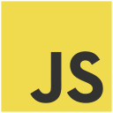
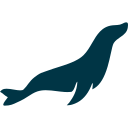
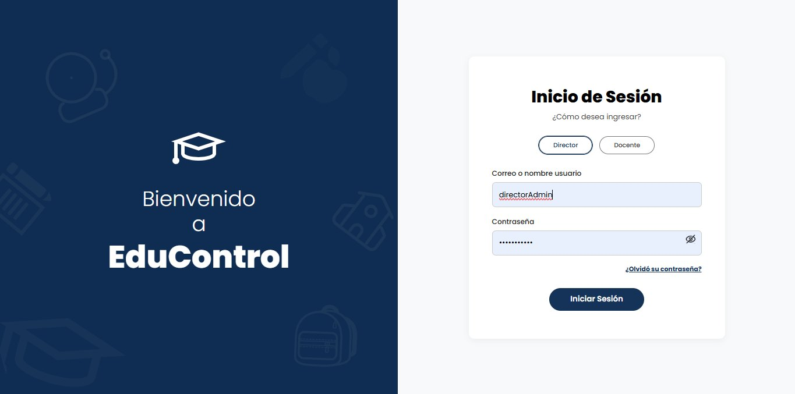
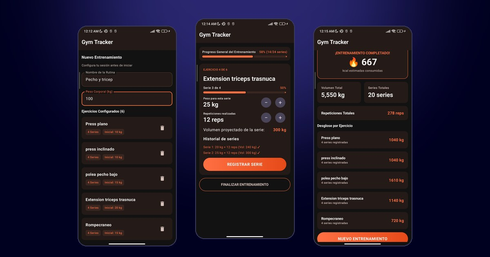

```{=html}
<div class="md-landing">

<section class="md-hero">
  <div class="md-wrap">
    <div>
      <p class="md-kicker">Hola, soy estudiante de IT</p>
      <h1>Soy Manuel<br><span class="md-grad">Herrera</span></h1>
      <p>Estudio Ingeniería en Tecnologías de la Información e Innovación Digital y me interesa el desarrollo de aplicaciones web. En proyectos académicos he trabajado frontend, backend, diseño de bases de datos, integración de APIs y despliegue en la nube con AWS. Me apasiona aprender tecnologías nuevas y desarrollar soluciones eficientes y de calidad.</p>
      <div class="md-actions">
        <a class="md-btn is-solid" href="blog.html">Ver mi blog →</a>
        <a class="md-btn" href="#proyectos">Conocer proyectos</a>
      </div>
    </div>
    <!-- Pon tu foto en img/mifoto.jpeg; si no existe se ven tus iniciales -->
    <div class="md-avatar">MH</div>
  </div>
</section>

<section id="sobre-mi">
  <div class="md-wrap">
    <p class="md-kicker">Sobre mí</p>
    <h2 style="margin-top:0">Un espacio para documentar lo que aprendo</h2>
    <p>Aquí voy dejando registro de mi proceso de aprendizaje: proyectos, tecnologías y experiencias durante la carrera.</p>
    <h2>Tecnologías</h2>
    <!-- Íconos de Devicon (devicon.dev, licencia MIT) -->
    <ul class="md-langs">
      <li>HTML</li>
      <li>CSS</li>
      <li>JavaScript</li>
      <li>Java</li>
      <li>Kotlin</li>
      <li>Python</li>
      <li>C</li>
      <li>C++</li>
      <li>MySQL</li>
      <li>MariaDB</li>
      <li>AWS</li>
      <li>GitHub</li>
    </ul>
  </div>
</section>

<section id="proyectos">
  <div class="md-wrap">
    <p class="md-kicker">Proyectos</p>
    <div class="md-two">
      <div>
        <h2 style="margin-top:0">EduControl</h2>
        <p>Sistema web de gestión académica para una escuela primaria, con roles de director y docente. Lo hicimos en equipo de tres como proyecto integrador; yo trabajé parte del backend, la base de datos y el despliegue en AWS.</p>
        <div class="md-tech">
          <span class="md-pill">HTML</span><span class="md-pill">CSS</span><span class="md-pill">JavaScript</span><span class="md-pill">Java + Javalin</span><span class="md-pill">MariaDB</span><span class="md-pill">AWS</span>
        </div>
        <p style="margin-top:1.4rem"><a class="md-btn" href="posts/proyecto-integrador/index.html">Leer cómo lo hicimos →</a></p>
        <p class="md-kicker" style="margin-top:2.4rem">Mi rol</p>
        <ul class="md-role">
          <li><i class="bi bi-server"></i>Backend en Java + Javalin</li>
          <li><i class="bi bi-database"></i>Base de datos en MariaDB</li>
          <li><i class="bi bi-cloud-arrow-up"></i>Despliegue en AWS EC2</li>
          <li><i class="bi bi-people"></i>Trabajo en equipo de 3</li>
        </ul>
      </div>
      <div class="md-grid-2" style="grid-template-columns:1fr">
        <a class="md-shot" href="posts/proyecto-integrador/index.html"></a>
        <div class="md-card"><h3>Registro diario</h3><p>Tareas, exámenes, participación, disciplina y asistencia por grupo.</p></div>
        <div class="md-card"><h3>Calificaciones y reportes</h3><p>Cierre de periodo con ponderación automática, gráficas y dashboard.</p></div>
      </div>
    </div>

    <div class="md-two" style="margin-top:4rem">
      <div>
        <h2 style="margin-top:0">Gym Tracker</h2>
        <p>App Android para planear una rutina de pesas, registrar cada serie en tiempo real y ver un resumen con el volumen total y las calorías estimadas. La desarrollé para practicar MVVM con toda la lógica en el ViewModel.</p>
        <div class="md-tech">
          <span class="md-pill">Kotlin</span><span class="md-pill">Jetpack Compose</span><span class="md-pill">MVVM</span><span class="md-pill">StateFlow</span>
        </div>
        <p style="margin-top:1.4rem"><a class="md-btn" href="posts/kotlin-compose/index.html">Leer cómo la hice →</a>&nbsp;<a class="md-btn" href="https://github.com/manu-09-web/GymAppkt">Ver código</a></p>
        <p class="md-kicker" style="margin-top:2.4rem">Mi rol</p>
        <ul class="md-role">
          <li><i class="bi bi-phone"></i>App Android nativa</li>
          <li><i class="bi bi-code-slash"></i>Kotlin + Jetpack Compose</li>
          <li><i class="bi bi-diagram-3"></i>Arquitectura MVVM</li>
          <li><i class="bi bi-lightning-charge"></i>Estado con StateFlow</li>
        </ul>
      </div>
      <div class="md-grid-2" style="grid-template-columns:1fr">
        <a class="md-shot" href="posts/kotlin-compose/index.html"></a>
        <div class="md-card"><h3>Registro por serie</h3><p>Peso y repeticiones de cada serie, con progreso por ejercicio y general.</p></div>
        <div class="md-card"><h3>Resumen del entrenamiento</h3><p>Volumen, series, repeticiones y calorías estimadas, con desglose por ejercicio.</p></div>
      </div>
    </div>
  </div>
</section>

<section id="aprendizaje">
  <div class="md-wrap">
    <p class="md-kicker">Aprendizaje</p>
    <h2 style="margin-top:0">Certificaciones y cursos</h2>
    <div class="md-statcards">
      <div class="md-card"><i class="bi bi-patch-check"></i><strong>7</strong><span>certificaciones</span></div>
      <div class="md-card"><i class="bi bi-building"></i><strong>4</strong><span>instituciones</span></div>
      <div class="md-card"><i class="bi bi-cloud"></i><strong>AWS</strong><span>Cloud Foundations</span></div>
    </div>
    <div class="md-year" style="margin-top:1.5rem">
      <h2>2026</h2>
      <div class="md-row"><span class="md-row-date">21 Jun</span><span class="md-cert"><i class="bi bi-award"></i><span><span class="md-row-title">Fundamentos de Ciberseguridad</span><span class="md-row-desc">Santander Open Academy · 1.5 h</span></span></span></div>
      <div class="md-row"><span class="md-row-date">23 Abr</span><span class="md-cert"><i class="bi bi-award"></i><span><span class="md-row-title">Fundamentos de Python</span><span class="md-row-desc">Gobierno de México / INFOTEC · 30 h</span></span></span></div>
      <div class="md-row"><span class="md-row-date">21 Mar</span><span class="md-cert"><i class="bi bi-award"></i><span><span class="md-row-title">Operating Systems Support</span><span class="md-row-desc">Cisco Networking Academy</span></span></span></div>
      <div class="md-row"><span class="md-row-date">13 Feb</span><span class="md-cert"><i class="bi bi-award"></i><span><span class="md-row-title">Operating Systems Basics</span><span class="md-row-desc">Cisco Networking Academy</span></span></span></div>
    </div>
    <div class="md-year">
      <h2>2025</h2>
      <div class="md-row"><span class="md-row-date">22 Nov</span><span class="md-cert"><i class="bi bi-award"></i><span><span class="md-row-title">AWS Academy Graduate - Cloud Foundations</span><span class="md-row-desc">AWS Academy · 20 h</span></span></span></div>
      <div class="md-row"><span class="md-row-date">16 Nov</span><span class="md-cert"><i class="bi bi-award"></i><span><span class="md-row-title">Introducción al Internet de las Cosas y Transformación Digital</span><span class="md-row-desc">Cisco Networking Academy</span></span></span></div>
      <div class="md-row"><span class="md-row-date">28 Oct</span><span class="md-cert"><i class="bi bi-award"></i><span><span class="md-row-title">Conceptos básicos de redes</span><span class="md-row-desc">Cisco Networking Academy</span></span></span></div>
    </div>
  </div>
</section>

<section id="contacto">
  <div class="md-wrap">
    <p class="md-kicker">Contacto</p>
    <h2 style="margin-top:0">Conectemos</h2>
    <p>Encuéntrame, conoce mi trabajo o escríbeme.</p>
    <div class="md-grid-2" style="margin-top:1.5rem">
      <a class="md-card" href="https://github.com/manu-09-web" rel="me"><i class="bi bi-github md-card-icon"></i><h3>GitHub</h3><p>Proyectos y código</p></a>
      <a class="md-card" href="https://www.linkedin.com/in/manuel-de-jes%C3%BAs-herrera-b59a39436" rel="me"><i class="bi bi-linkedin md-card-icon"></i><h3>LinkedIn</h3><p>Perfil profesional</p></a>
      <a class="md-card" href="mailto:chusinhm19@gmail.com"><i class="bi bi-envelope md-card-icon"></i><h3>Correo</h3><p>chusinhm19@gmail.com</p></a>
      <a class="md-card" href="blog.xml"><i class="bi bi-rss md-card-icon"></i><h3>RSS</h3><p>Suscríbete a las entradas nuevas</p></a>
    </div>

    <h2>¿Tienes un proyecto en mente?</h2>
    <p>Cuéntame qué idea tienes y cómo puedo ayudarte.</p>
    <!-- Un sitio estático no envía correos solo: crea un formulario gratis en formspree.io y pega aquí tu ID -->
    <form class="md-form" action="https://formspree.io/f/TU-ID" method="POST">
      <label>Correo electrónico
        <input type="email" name="email" placeholder="tu@correo.com" autocomplete="email" required>
      </label>
      <label>Mensaje o proyecto
        <textarea name="message" rows="5" placeholder="Cuéntame de tu proyecto" required></textarea>
      </label>
      <div><button class="md-btn is-solid" type="submit">Enviar mensaje</button></div>
    </form>
  </div>
</section>

</div>
```
