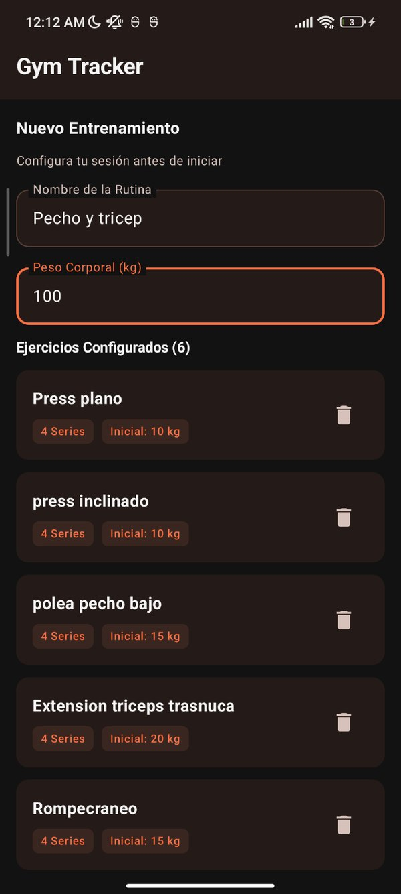
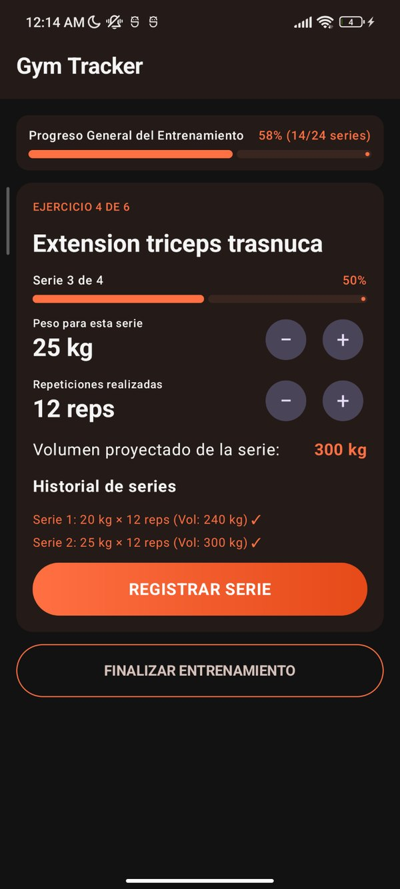
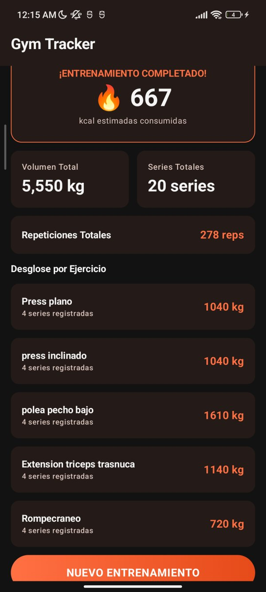

Quien entrena con pesas suele apuntar sus series de forma desordenada, o de plano las recuerda. Después, sacar cuentas como cuánto peso levantó en total o cuántas calorías gastó es tedioso si se hace a mano.

De ahí salió **Gym Tracker**, mi proyecto de la primera unidad de Desarrollo de Aplicaciones Móviles: una app Android que lleva el registro del entrenamiento y hace esas cuentas por uno. El código está en [mi repositorio de GitHub](https://github.com/manu-09-web/GymAppkt).

## Las reglas del proyecto

La finalidad era practicar el patrón MVVM, pero con restricciones claras:

- Sin base de datos ni otro tipo de persistencia.
- Sin APIs ni internet.
- Sin hardware del dispositivo (cámara, GPS, sensores).

Todo tenía que vivir en memoria, dentro de un ViewModel. Por eso usé MVVM solo con dos capas:

- El **ViewModel** guarda el estado, atiende los eventos, valida lo que escribe el usuario y hace todos los cálculos.
- La **View** dibuja lo que recibe y avisa cuando el usuario hace algo. No toma decisiones.

## Tres pantallas, tres fases

La app pasa por tres fases, y cada una tiene su pantalla: configurar la rutina, entrenar y ver el resumen.

::: {layout-ncol=3}





:::

En la primera se captura el nombre de la rutina, el peso corporal y los ejercicios. El botón de comenzar solo se enciende cuando hay nombre, peso y al menos un ejercicio.

En la segunda se ajusta el peso de 5 en 5 kg y las repeticiones de 1 en 1, y se registra cada serie. Cuando se completan las series de un ejercicio, la app pasa sola al siguiente.

La tercera muestra el volumen total, las series, las repeticiones y las calorías estimadas, con el desglose por ejercicio.

## Cómo viaja un evento

El estado es inmutable y se expone con un `StateFlow`. Cada vez que el usuario toca algo pasa lo mismo:

1. La vista llama a una función del ViewModel.
2. El ViewModel crea una copia nueva del estado con el cambio.
3. El `StateFlow` publica ese estado.
4. Compose vuelve a dibujar solo lo que cambió.

```kotlin
// Versión simplificada de la idea
class EntrenamientoViewModel : ViewModel() {

    private val _estado = MutableStateFlow(EstadoEntrenamiento())
    val estado: StateFlow<EstadoEntrenamiento> = _estado.asStateFlow()

    fun alRegistrarSerie() {
        _estado.update { actual ->
            actual.copy(/* nueva lista de series y valores recalculados */)
        }
    }
}
```

El estado baja del ViewModel a la vista y los eventos suben de la vista al ViewModel. A eso se le llama flujo unidireccional de datos.

## Lo que más me costó

**Conectar las pantallas.** No sabía cómo pasar de una a otra sin enredar la lógica. Lo resolví con una clase `enum` que guarda en qué fase está la app. La vista solo revisa ese valor y muestra la pantalla que toca:

```kotlin
enum class FaseEntrenamiento { CONFIGURANDO, ENTRENANDO, RESULTADOS }

// En la vista principal (versión simplificada)
when (estado.fase) {
    FaseEntrenamiento.CONFIGURANDO -> PantallaConfiguracion(/* estado y eventos */)
    FaseEntrenamiento.ENTRENANDO   -> PantallaEntrenamiento(/* estado y eventos */)
    FaseEntrenamiento.RESULTADOS   -> PantallaResumen(/* estado y eventos */)
}
```

**La lógica de los cálculos.** La app calcula muchas cosas al mismo tiempo: volumen de la serie, progreso del ejercicio, progreso general, totales y calorías. Si un valor cambia, todos los que dependen de él tienen que actualizarse.

**Reorganizar el código.** Empecé con todo en una sola vista y un ViewModel. Después lo separé en tres pantallas, once componentes reutilizables y una clase de datos para el estado. Fue un cambio grande, pero el código quedó más ordenado. Ningún componente guarda estado propio: reciben los datos que muestran y avisan los eventos con funciones.

**Los errores que solo salen al probar.** En orientación horizontal no se podía deslizar hasta los botones y un campo del diálogo se veía aplastado. Lo arreglé usando `LazyColumn` para que el contenido tuviera scroll.

## Las cuentas: volumen y calorías

El volumen de una serie es el peso por las repeticiones. Por ejemplo, 30 kg × 8 repeticiones son 240 kg.

Las calorías se estiman con el método de los equivalentes metabólicos (MET), que indica cuántas veces más energía gasta el cuerpo en una actividad que en reposo:

$$
\text{kcal} = \text{MET} \times \text{peso corporal (kg)} \times \frac{\text{minutos}}{60}
$$

Usé un MET de 5.0, un valor intermedio para una sesión de pesas según el [Compendium of Physical Activities](https://pacompendium.com/conditioning-exercise). Como la app no tiene cronómetro, los minutos se estiman como series completadas × 4.

Con 80 kg de peso corporal y 16 series: 16 × 4 = 64 minutos, y 5.0 × 80 × (64 ÷ 60) da 427 kcal.

Es una estimación. No mide el tiempo real ni la intensidad, así que el número es solo una referencia.

## Lo que aprendí sobre cómo se construye una app

Además de Compose, entendí qué pasa desde que escribo código hasta que la app llega al teléfono:

- El código Kotlin se compila a bytecode.
- **D8** convierte ese bytecode al formato DEX, que es el que ejecuta Android.
- **R8** entra en las versiones de lanzamiento: elimina el código que no se usa, lo optimiza y lo ofusca para que la app pese menos.
- Al final todo se empaqueta y se firma.

También me quedó clara la diferencia entre los dos formatos de salida:

| Formato | Para qué sirve |
|---------|----------------|
| **APK** | Es el archivo que se instala directo en el teléfono. |
| **AAB** | Es el formato para publicar en Google Play, que con él genera un APK a la medida de cada dispositivo. No se instala directamente. |

## Qué le cambiaría hoy

El proyecto estaba enfocado en aprender a separar responsabilidades entre View y ViewModel, no en sacar una app al mercado. Por eso le falta:

- Una interfaz más trabajada y con animaciones.
- Guardar el historial de entrenamientos en una base de datos local.
- Un cronómetro para medir el tiempo real y calcular mejor las calorías.
- Guardar y reutilizar rutinas.
- Ejercicios y grupos musculares predefinidos para armar la rutina más rápido.

Aun así, es el proyecto con el que por fin entendí cómo funciona una app por dentro.
