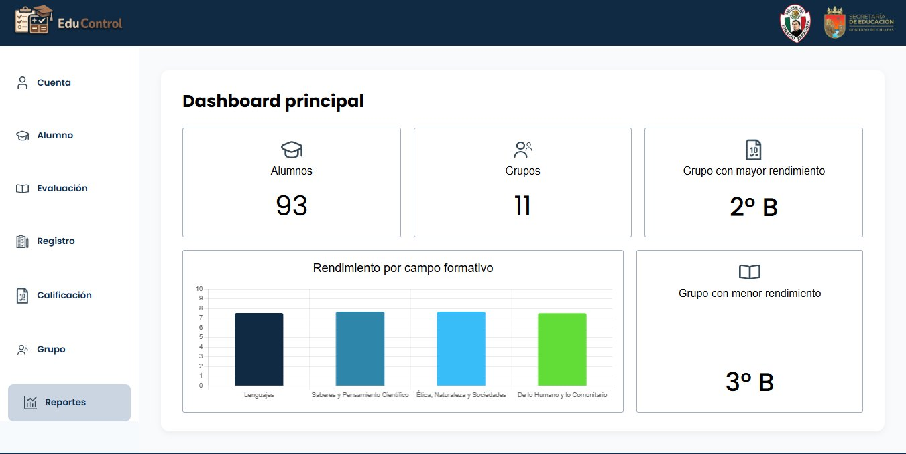
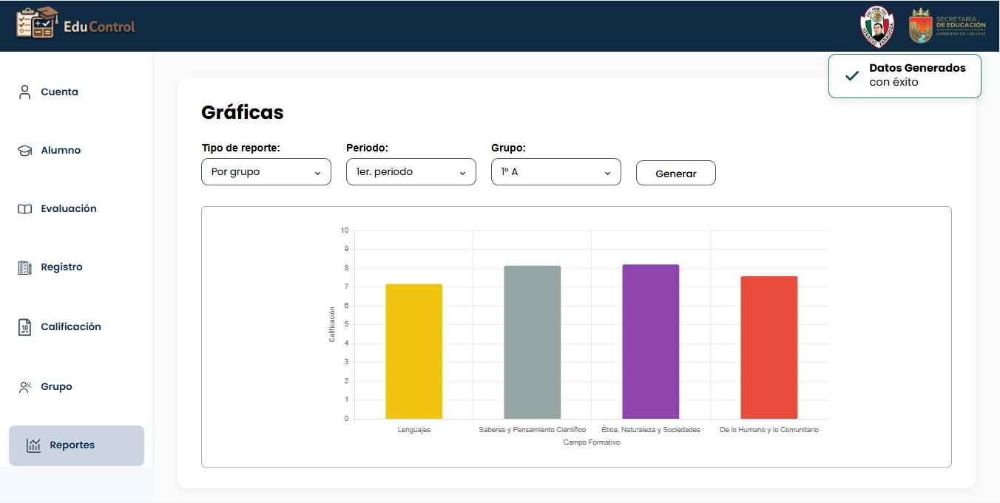

**EduControl** es una aplicación web para llevar el control académico de una escuela primaria: alumnos, grupos, evaluaciones, calificaciones y reportes, todo en un solo lugar.

Fue nuestro proyecto integrador, que juntaba cuatro materias: la integradora, Programación Orientada a Objetos, Bases de Datos y Diseño de Software. Lo desarrollamos en un equipo de tres personas.

## Qué hace el sistema

Tiene dos tipos de usuario, y cada uno ve cosas distintas:

| | Docente | Director |
|---|---|---|
| **Alumnos** | Solo los de su grupo | Todos los de la escuela |
| **Criterios de evaluación** | Ajusta los porcentajes de su grupo | Consulta los de cada docente |
| **Registro diario** | Captura tareas, exámenes, participación, disciplina y asistencia | Sin acceso |
| **Calificaciones** | Las de su grupo | Las de cualquier grupo |
| **Grupos** | Consulta | Crea, edita y asigna docentes |
| **Reportes** | Los de su grupo | Los de toda la institución |

El trabajo del día a día lo hace el docente en el módulo de registro. Con esos datos el sistema calcula lo demás.

## El cierre de periodo

Cada docente define cuánto vale cada criterio, por ejemplo tareas 30 %, asistencia 10 %, participación 10 %, disciplina 10 % y examen 40 %. La suma tiene que dar 100 %.

Al dar clic en "Fin de periodo", el sistema toma todos los registros acumulados, aplica esa ponderación y genera las calificaciones finales por campo formativo. Tiene una regla: no deja cerrar el periodo si algún criterio se quedó sin registros.

A partir de ahí las calificaciones ya no se capturan a mano. Solo se consultan, junto con las gráficas y estadísticas que salen de los mismos datos.

## Con qué lo construimos

| Parte | Tecnología |
|-------|------------|
| Frontend | HTML, CSS y JavaScript |
| API | Java con Javalin |
| Base de datos | MariaDB |
| Nube | AWS (EC2) |

## Mi parte

Yo trabajé tres cosas:

- **Parte del backend**: la API en Java con Javalin.
- **La base de datos** en MariaDB.
- **El despliegue en AWS (EC2)** de las tres piezas: frontend, backend y base de datos.

## Lo que más nos costó

**Conectar el backend con el frontend.** Cada parte funcionaba por separado, pero hacer que el navegador hablara bien con la API fue lo que más tiempo nos llevó.

**Planear la base de datos.** La diseñamos antes de empezar, pero sobre la marcha nos dimos cuenta de que faltaban cosas: tablas, relaciones y campos que no habíamos previsto. Las fuimos resolviendo poco a poco, con ayuda y retroalimentación de los maestros que evaluaban el proyecto.

Lo que me llevo de ahí es que el primer diseño de una base de datos casi nunca es el definitivo, y que conviene validarlo contra las pantallas reales lo antes posible.

## Qué le cambiaría hoy

- **Que sirva para cualquier escuela.** EduControl se diseñó a la medida de una sola primaria. Hoy lo haría para que cualquier escuela pudiera usarlo.
- **Una vista para supervisores.** Solo tiene dos roles, director y docente. En una nueva versión agregaría un tercero para supervisores.
